# Chassis

**Chassis Type:** We used AndyMark’s AM14U5 chassis because it is a part of the Kit of Parts and is well tested and reliable. The included 6" rubber treaded wheels allow for easy traversing across the field and over the cable protector. The center wheel of the AM14U5 is dropped ⅛” lower than the other wheels, this will allow for static friction when turning side to side, thus making it easier to make micro adjustments when picking up or scoring game pieces.

**Chassis Size:** We picked the chassis size based on a few factors. Early on we decided to make the chassis as thin as possible to make sure the Everybot can form alliances with robots who were interested in fitting all 3 robots on the Charge Station. Having a thinner chassis will also allow for better maneuverability in the community zone, as we expect it to be a highly congested area. Additionally we decided to decrease the length of the chassis as well which allowed us to use the "square" AM14U5 wheel holes. This allows for slightly better turning, increasing precision with picking and placing game pieces.

**Chassis Assembly**

Required tools:

* 1/4" socket and ratchet (preferred) or flat blade screwdriver or bit

* 1/2" wrench

* 9/16" wrenches or sockets

* 7/16" or similar size socket

* 3/8" socket or ratchet

* 5/32" allen wrench or t-handle

* Bandsaw or chop saw

Adjustable wrenches can be used in place of the 9/16" and 1/2” wrenches

A cordless drill and 10-32 tap are optional but can make assembly faster and easier

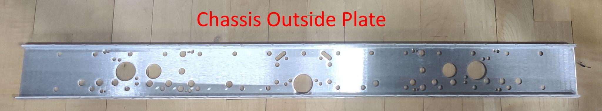All required parts are from the AndyMark AM14U5 "K23" 2023 Kit of Parts chassis box except for four CIM (or CIM-replacement) motors. Two CIM motors are included in the standard Kit of Parts, with two additional CIMs included in the Rookie Kit of Parts. The chassis assembly section of the manual refers to Andymark part numbers, so keeping the Andymark manual open to the parts checklist may help you when following this manual. One NEO motor will be used elsewhere on the Everybot, so if you only have four NEOs do not use them on your drivetrain.

Before beginning to assemble the chassis, the two Chassis End Plates will need to be cut down to 22" by removing 9” from one end. The Chassis Inside and Outside Plates will all have 2” cut off of each end for a final length of 28”. The two 24” churros will need to be cut down to 13.25”. If the size of your team allows for it, have someone begin making these cuts while another group begins assembling the wheels. Measure out your cuts and mark them with a combination square to make sure your cuts are perpendicular and cut the plates in a bandsaw or chop saw, making sure to account for the width of your blade. Save all of these cutoff pieces for later.

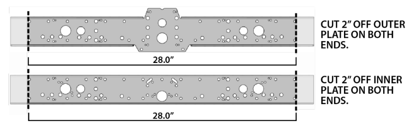

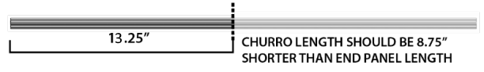

**Wheel assembly**

Start assembling the wheels by screwing two pulley halves into one side of each wheel. Each half-pulley (AndyMark part number am-2234a-half) has one raised screw hole and one recessed screw hole on the bottom. Connect two halves together by lining the raised portion of one half with the recessed hole on the other. The ridged portion of the pulley that the belt will actually ride on should line up across the two pulleys with no gaps or misaligned teeth. The pulley is then screwed into the matching hole pattern on one side of the 6" HiGrip wheel (am-0940b) using six 10-12 1.25” screws (am-1592). Tighten these bolts in a star pattern like you would when changing a tire on a car to ensure the pulley is aligned evenly on the wheel.

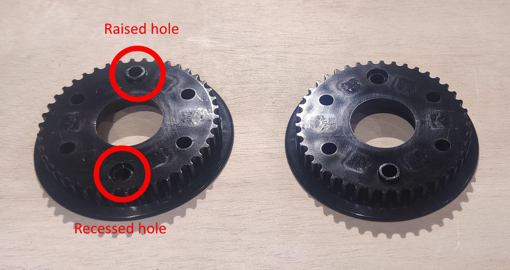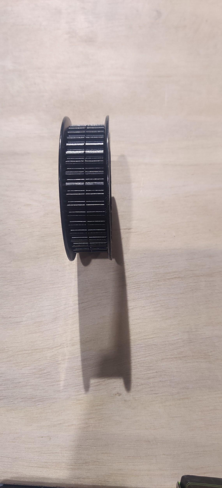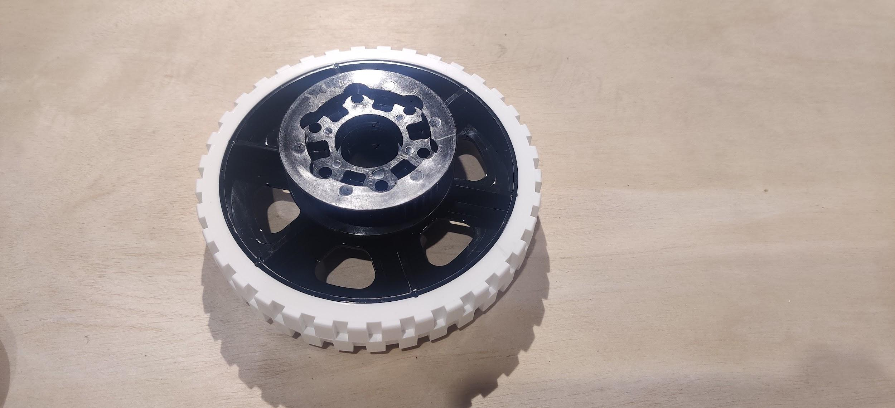

A 1/4" socket driver is preferred over a flat bladed screwdriver for fully tightening these form-threading screws as they will need more force applied to them in order to cut away the plastic hub of the wheel. The socket driver does need to be somewhat thin-walled, as a large driver will foul on the pulley before the screws are fully tightened. A ratcheting driver or a drill will also make the process much faster.

Four of the wheels will have two 1614ZZ 3/8" round inner diameter bearings (AndyMark part number am-0209) pushed into either side. One bearing will push into the open center of the pulley and the other will push into the open center of the wheel. Do not hammer or otherwise harshly strike the sides of the bearings to push them into place as this can easily damage the bearing. The bag that these bearings come in contains two bearings with a flange - a raised ridge around one of the outside edges. Set these bearings aside for later.

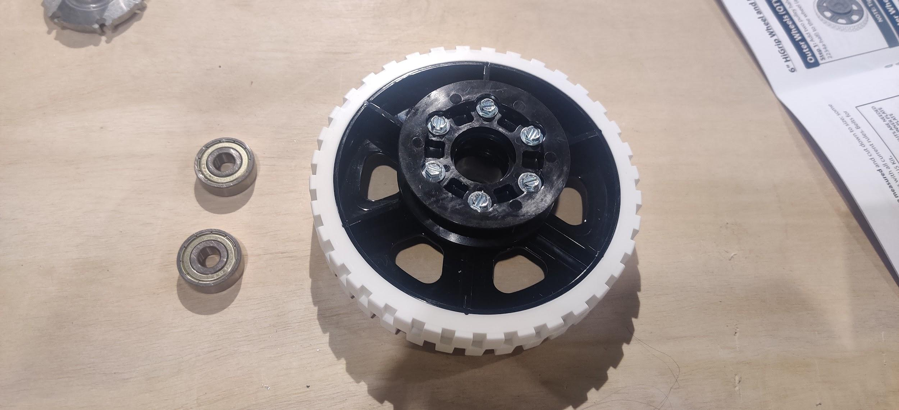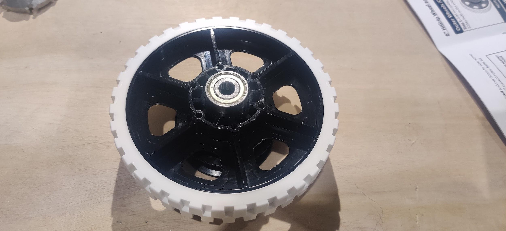

One easy way to make sure they are seated correctly is to line the wheel up on top of the bearing on a table and push the wheel down firmly until the bearing slips into place. The bearings will stick out of the bare half of the wheel slightly and be flush with the top of the pulley. These will be the front and back wheels of the robot.

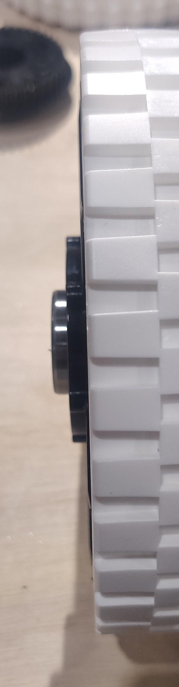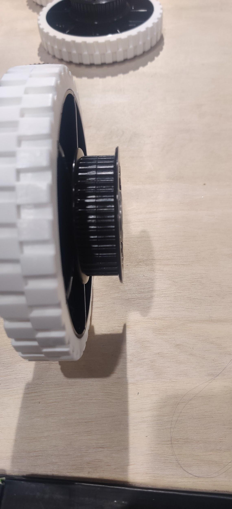

The other two wheels will have one of the remaining pulleys added to the other side with a 1/2" hex hub inserted inside it. The easiest way to line up the hub is to insert one half of a pulley onto the hub’s shaft and line up the screw holes in the hub with the screw holes in the pulley by putting a few of the form-threading screws through the hub and pulley. Push the other half of the pulley down to meet it, matching up the raised and recessed holes as before. 

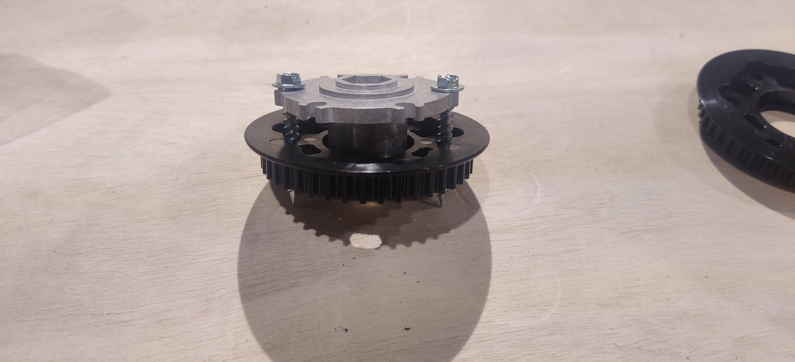Now the hub can be screwed onto the other side of the wheel using the same 10-12 1.25" screws (am-1592) as the previous pulleys. These will be the robot’s middle wheels.

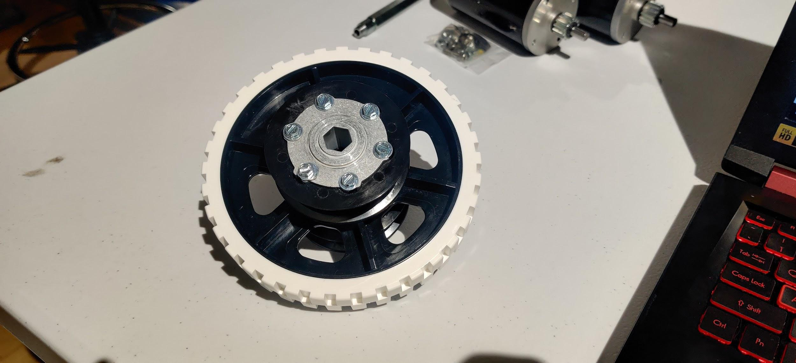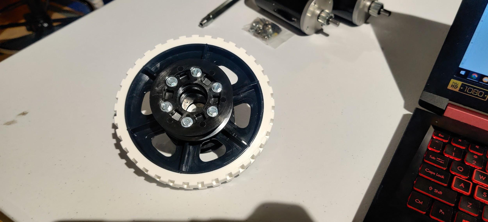

**Motor and gearbox assembly**

For each of your four drivetrain motors, place two 5/16" washers (am-1009a) onto the shaft. If your team is a rookie team, your kit of parts should include four CIM motors. If you are not a rookie, your kit will contain only two CIM motors, so you will need to purchase two new motors or reuse two from a previous year (recommended). If you already own more than four NEO motors, consider using them in your drivetrain instead of CIMs. One NEO motor will be used elsewhere on the Everybot, so if you only have four NEOs do not use them on your drivetrain.

Slide a 14 tooth pinion gear (am-0034) onto the motor shaft, lining up the key with the gear’s keyway. Clip the stackup onto the motor shaft using an 8mm retaining clip (am-0033) with the teeth of the clip pointing inwards. Do not push the clip fully down against the gear or it can cause the motor to bind.

Placing a 7/16" or 3/8” socket over the clip and hitting it with a mallet can assist in pushing the clip down onto the shaft. This can be fairly difficult to do, and if the clip becomes deformed you should try to flatten it back out.

Screw two of the motors into each Toughbox Mini gearbox housing (am-0650). The output shafts of the motors line up with the two larger holes in the gearbox housing and are screwed in using 10-32 x 0.625" bolts with thread lock already applied (am-1120) through the mounting holes above and below the input shafts and into the two mounting holes in the face of the motor. As these bolts approach fully tightened they become harder to turn. Make sure the bolts are actually fully tightened or the CIM motors will flex and rock around in the gearbox. If you can wiggle the CIM motors by hand then they need to be tightened more.

These bolts can be identified easily by the small patch of yellow or white thread lock on the threads of the bolt. Threadlocker is used on these bolts so that the motors do not vibrate them free over time. They are also shorter than the 10-32 x 0.75" bolts that come in the same bag.

CIMs have four holes in the face of the motor. Two already have long cross-head screws inserted from the bottom of the motor to keep them together, so you may have to rotate the CIM motors around until the two open holes line up with the mounting holes in the gearbox housing. 

	"Blocked" versus open mounting holes

Two of the bearings used in the Toughbox have flanges while the other two do not. A flanged bearing has a small ring extending around it as shown below. One of the gears in the Toughbox has a "boss" on one side, which is a raised ring around its center hex hole. Keep this in mind when moving forward with gearbox assembly.

	

Press two R6ZZ 3/8" round inner diameter bearings (am-0516) without flanges into the two center holes of the Toughbox Mini housing. Insert the Toughbox small 3/8” hex shaft (am-0152) into the bearing closer to the flat end of the gearbox housing.

Take the 3/8" hex 50 tooth gear (am-0149) and place it with the raised boss facing down onto the 3/8” hex shaft so that the flat side is facing up.

Place the 3/8" hex spacer onto the 3/8” hex shaft on top of the 50 tooth gear. Then add the 19 tooth gear onto the same shaft so it sits on top of the spacer.

 

Install the 1/2" E-clip (am-0206) into the groove in the Toughbox 1/2” hex output shaft (am-2566b) by pushing the shaft down onto the clip.

  

If you plan on adding encoders to the Everybot (see the [Suggested Improvements](https://docs.google.com/document/d/1q2b-Aj2qL-e8q0LyJSA-Xj8--UgQs6mV6OJV3niVg_Q/edit#heading=h.tba20tcjnbex) section for more information), install the encoder pin shafts (am-1323) into the 1/2" hex output shaft now. Clean the pins off and super glue them into the holes in the ends of each 1/2” hex output shaft. Let them dry before continuing.

Insert the 1/2" hex output shaft into the other R6ZZ bearing with the E-clip closer to the bearing. Place the 45 tooth 1/2” hex gear (am-0885) onto the output shaft.

Place the FRZ6ZZ 3/8" round center bearing with flange (am-0028) onto the other end of the short 3/8” hex shaft on top of the boss of the 19 tooth gear, with the flange of the bearing closer to the gear. Place the FR8ZZ-HexHD 1/2” hex center bearing with flange on the 1/2” hex output shaft on top of the boss of the 45 tooth gear, with the flange of the bearing closer to the gear.

If your team has a convenient way to run your drivetrain motors now, such as an electronics test bed with motor controllers or other method of power delivery or by plugging the motors to a previous year’s robot, it is recommended that you run in the gearbox "dry" for thirty minutes at this point. Before greasing the gears inside, attach the Toughbox Mini to the Chassis Inside Plate as described below and secure it. Connect whatever method you have for powering the motors and turn it on, leaving it to run in for thirty minutes. They will start out loud but should not produce an ear-splitting “squeal” or “screech.” If your gearbox is making excessive noise, take it apart and check that the boss on the 50 tooth gear is facing the bearing in the Toughbox casing. Afterwards, dismount the gearbox by undoing the four 10-32 bolts.

Once you have run in your gearbox, or if you do not have a convenient way to run in your gearboxes right now, apply red tacky grease (am-2768) to all the teeth of the gears. The flat surfaces of the gears are not as important as well-greasing the teeth where the gears actually mesh, and as the gearbox runs it will distribute the grease further.

(Re)attach the Toughbox Mini to the Chassis Inside Plate of the chassis using four 10-32 x 0.75" bolts (am-1047) and four 10-32 Nylock nuts (am-1042). The flat side of the gearbox lines up with the shorter side of the roughly trapezoidal gearbox mounting area in the center of the Chassis Inside Plates and the tapered side of the gearbox mates with the longer side of the trapezoid. The flanges on the Chassis Inside Plates should face away from the gearbox on the flat side (the top of the gearbox) and towards the gearbox on the tapered side (the bottom of the gearbox).

Make sure both of the flanged bearings are correctly "trapped" inside the gearbox by already being installed on the shafts when the gearbox is pushed into the Chassis Inside Plate - taking them out of the gearbox, inserting the gearbox’s shafts through the holes, and then sliding the bearings onto the shafts from the other side of the Chassis Inside Plate will leave the bearings able to fall out.

If the bearings do not want to fit in the chassis holes, they can be arbor pressed into place (be sure to get the flange on the correct side of the Chassis Inside Plate so that the flange will end up inside the gearbox!) or the holes can be enlarged slightly with a deburring tool.

The 10-32 x 0.75" bolts should be inserted into the Chassis Inside Plate and through the gearbox casing with the 10-32 Nylock nuts inserted into the hexagonal holes in the back of the gearbox casing.

Complete these steps with both Toughboxes, affixing one to each Chassis Inside Plate.

**Chassis assembly**

The 2023 Everybot uses the Chassis End Plates in an upside down configuration as compared to the normal Kit of Parts chassis. Normally, the flange with two rows of holes is considered the top of the End Plates, but on the Everybot the longer flange is on the bottom and the flange with a single row of holes is on the top.

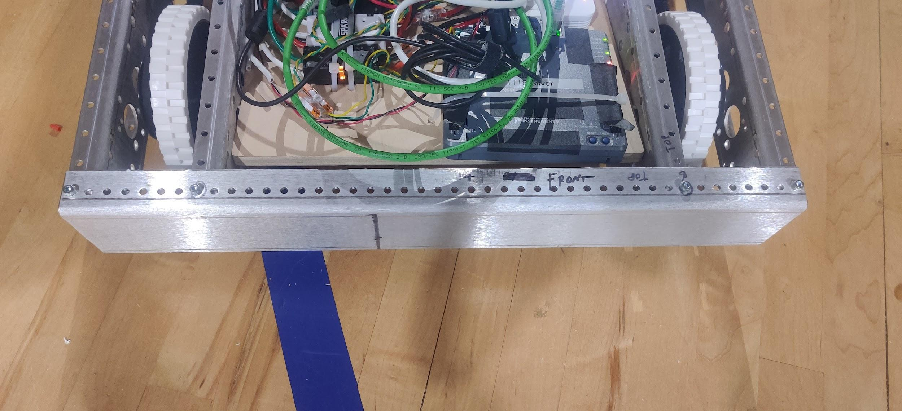

Everybot Chassis End Plate orientation (shorter flange on top)

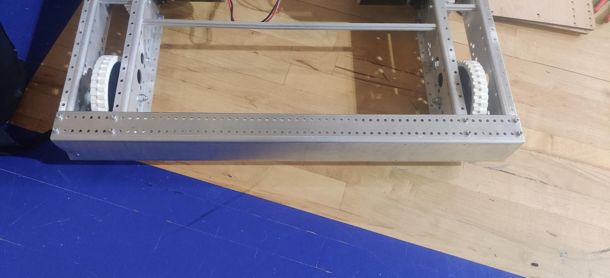

Typical Kit of Parts Chassis End Plate orientation (longer flange on top)

Insert one of the Chassis Inside Plates into one of the upside down Chassis End Plates. The motors sticking out of the gearbox should face towards the middle of the robot with the output shaft sticking outwards. The top flange of the Chassis Inside Plates should point towards the outside of the robot while the bottom flange should face inwards. Line up the outermost hole in the upper flange of the Chassis Inside Plate with the 8th hole in from the edge of the top of the (upside down) Chassis End Plate, with the first two holes in the bottom flange lining up with the 10th holes in from the edge of the bottom of the (upside down) Chassis End Plate.

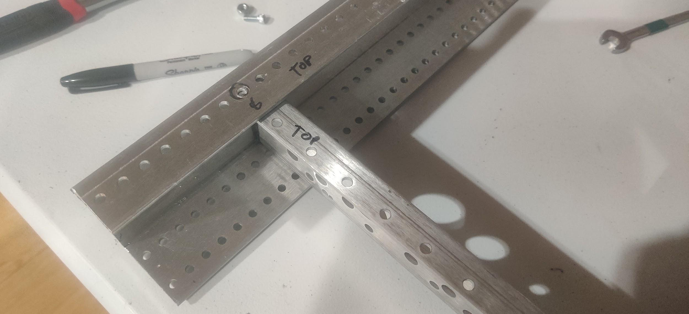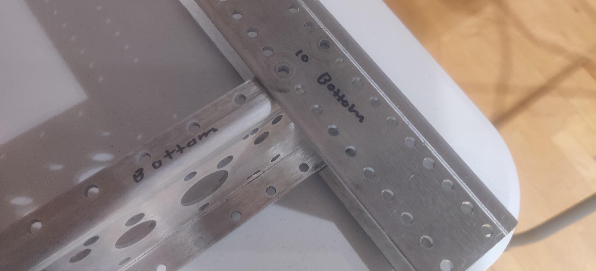

Top view							Bottom view

Attach the Inside and End plates with three 10-32 x 0.5" bolts (am-1002) and 10-32 Nylock nuts (am-1042) with one bolt going through the shorter flange of the End Plate and the top flange of the Inside Plate and an additional two bolts through the longer flange of the End Plate and the bottom flange of the Inside Plate. Mirror these steps with the other Chassis Inside Plate to attach the second side rail and gearbox to the Chassis End Plate.

	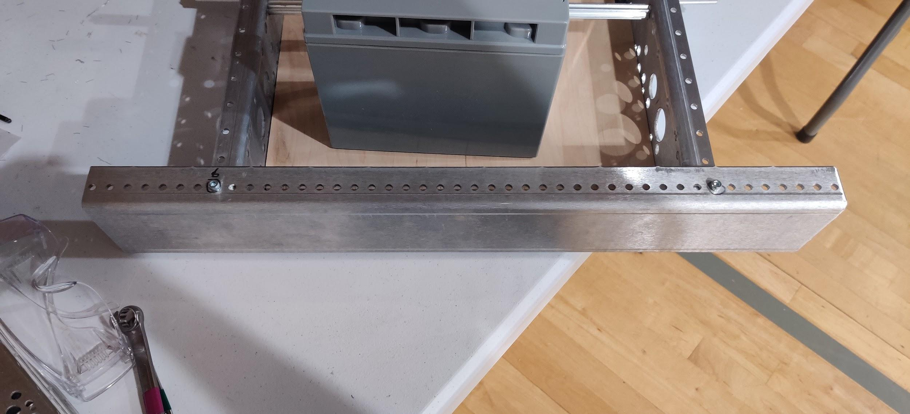

The other End Plate is similarly attached to the Inner Side Plates with the holes in the top flanges lining up with the eighth holes from the edge of the top of the end plates.

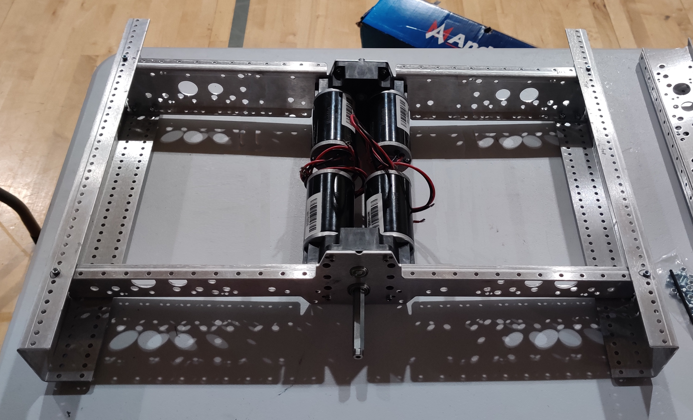

Using a carpenter’s square or similar tool, check that the frame of the chassis is "square" - that is, check that all four of the corners of the chassis form 90 degree angles. If your chassis is “bent” or otherwise off-angle it will have problems driving correctly and it will be difficult to complete the rest of the robot. If necessary, loosen the bolts in the offending corners and shift the plates until they form right angles with each other.

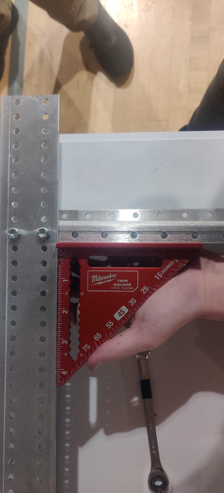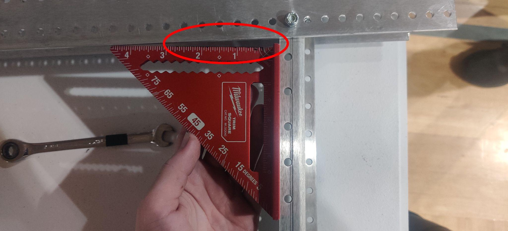

Squared corner			Not squared corner

Attach four of the 3.375" long churros to each side of the chassis using 1/4-20 x 0.75” form-threading bolts (am-1591) so that the churros extend outwards from the Chassis Inside Plate like the gearbox output shaft. A 1/2” hex wrench can be used to hold churro in place while tightening the bolts with a 3/8” wrench or ratchet. These bolts will require additional force to cut the threads into the churros. If desired, the 3.375” churros can be pre-tapped for a 1/4-20 bolt on both ends.

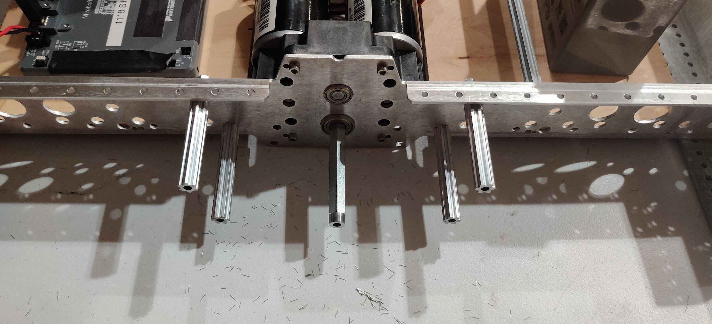

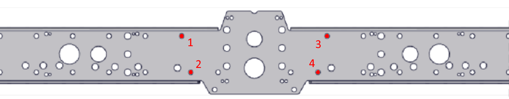

Place a center wheel with two pulleys on the Toughbox output shaft with the aluminum hex hub facing the gearbox. Place a nylon hex spacer (am-1305) onto the output shaft and press or tap it into the hole in the end of the pulley. The shaft will keep the spacer’s hexagonal bore aligned with the hex hub’s bore.

When the spacer is fully inserted into the wheel, the entire round portion at the end of the output shaft should be outside of the spacer.

If the spacer can not easily be pushed or tapped into place with a rubber mallet, you can remove the spacer and wheel and push the spacer into place by lining up the center hex patterns of the hub and spacer with a small piece of hex shaft or a churro and pushing the wheel down onto the spacer, similar to the way that the bearings were previously pushed into the front and rear wheels.

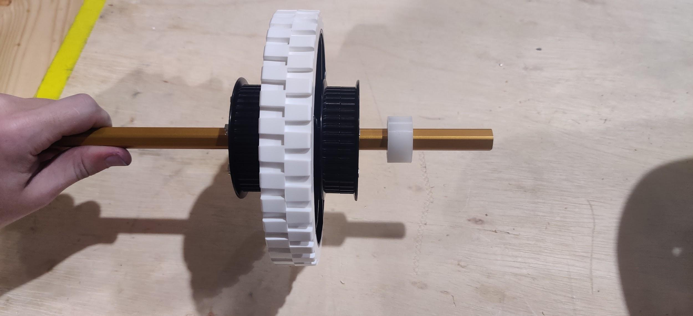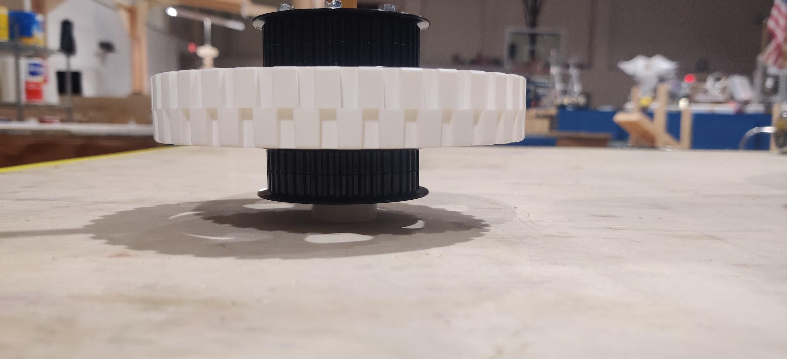

Loop two of the 131 tooth belts (am-2571, marked as 655 5M 15 on the belts themselves) around the center wheel. The belts will be stretched towards the front and back of the frame to couple the front and rear wheels to the driven inner wheel. Each belt will go underneath one of the previously installed churros and around the other.

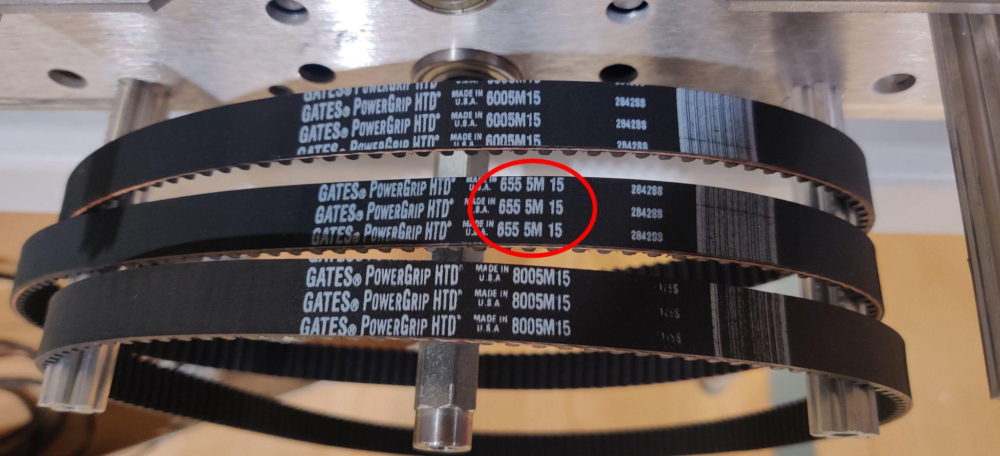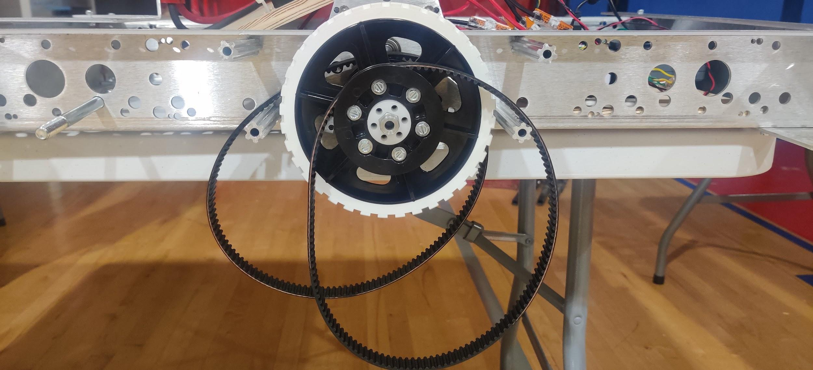

Decide which end of the robot will be the front and which will be the back. It is a good idea to mark the front and back Chassis End Plates now so that it is obvious which one is which later on.

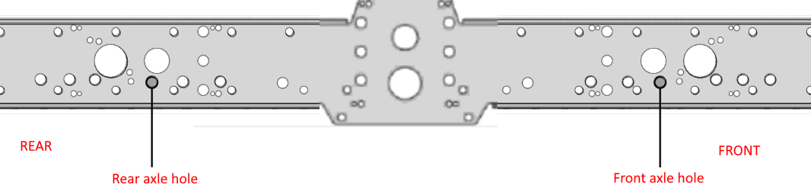

Insert one of the 3/8-16 4.25" bolts (am-1297) through the front axle hole in the diagram above from the inside of the chassis so that it sticks out similar to the churros and gearbox output shaft. Slip a short 0.28” nylon spacer (am-1306) over the bolt.

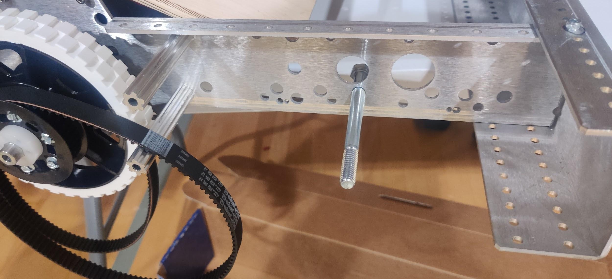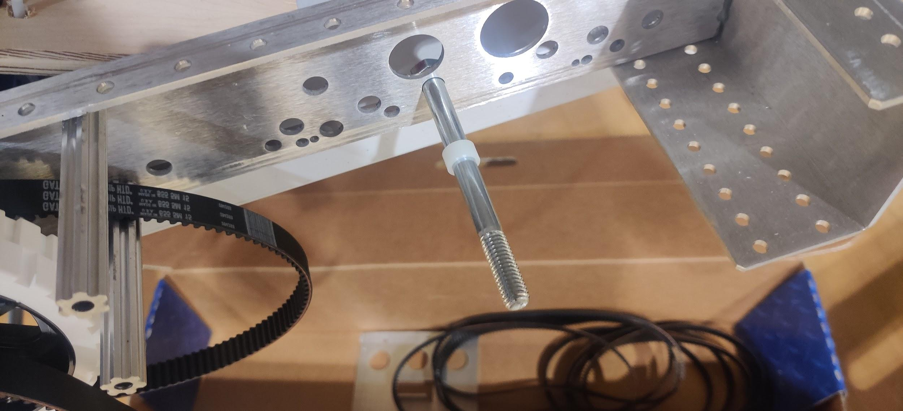

Take one of the four outer wheels and loop the belt around its pulley, making sure the pulley is towards the inside of the chassis and that the belt runs parallel with the side plates. Push the bolt through the two bearings in the wheel.

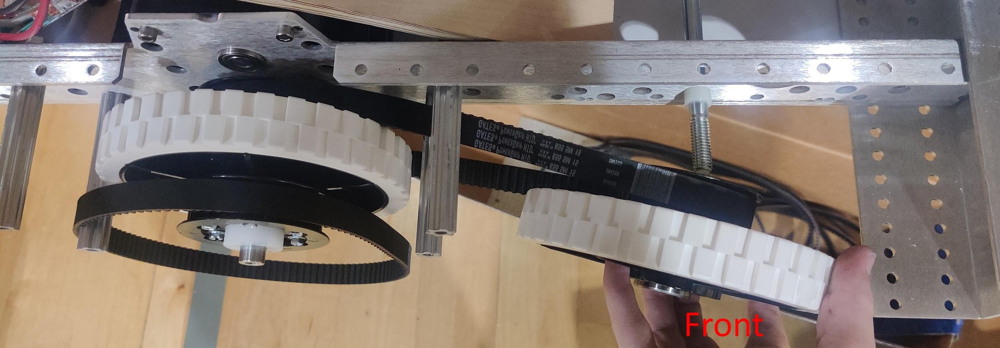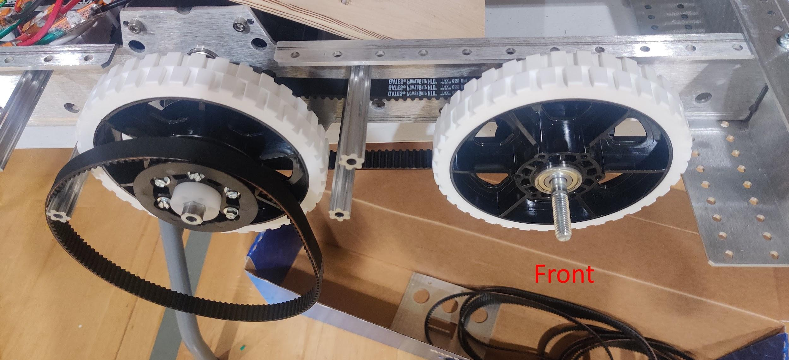

Put a longer 0.85" nylon spacer (am-1307) onto the end of the bolt. A 3/8-16 nut can be finger-tightened to the end of the axle to hold this assembly in place while setting up the back wheel.

Insert another 3/8-16 4.25" bolt (am-1297) through the back axle hole in the diagram above from the inside of the chassis so that it sticks out similar to the churros and gearbox output shaft. This time, put a longer 0.85” nylon spacer onto the end of the bolt first.

Pull the other 131 tooth belt towards the back of the robot, making sure it fits over the middle wheel’s outer pulley. Take another wheel and put the belt around its pulley, making sure the pulley is toward the outside of the chassis this time so that it is similarly parallel with the Chassis Inside Plate when the bolt is pushed through the wheel’s bearings. 

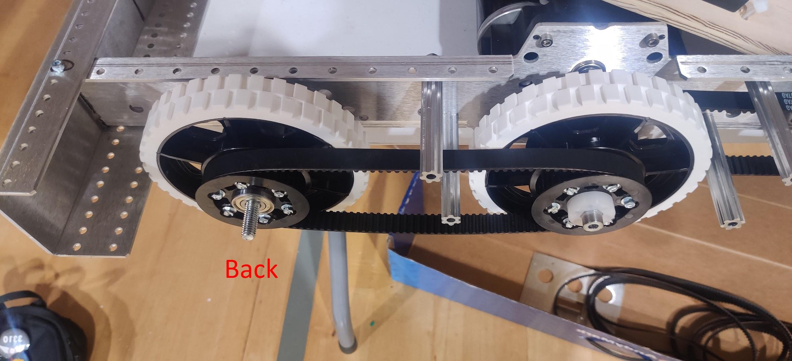

Now slip a short 0.28" nylon spacer over the end of the bolt. A nut can be tightened by hand to hold the stackup in place if necessary. With the churros, belts, wheels, and axles all in the correct position, the Chassis Outside Plate can be added.

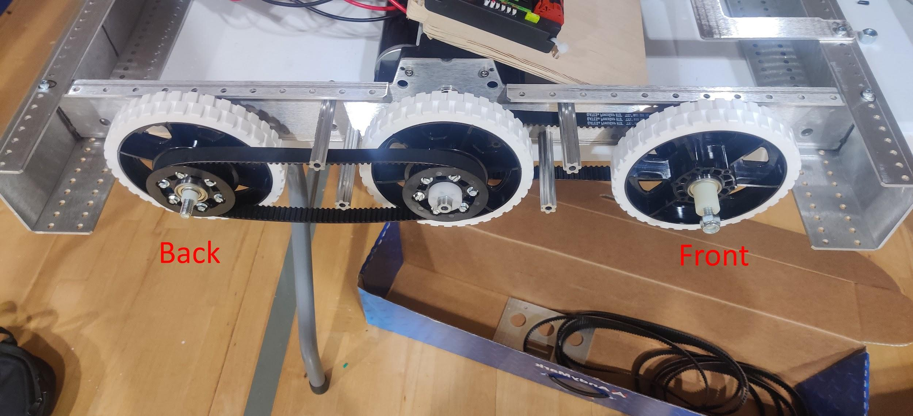

Press a FR8ZZ 1/2" round bearing (am-0030) into the center hole of each Chassis Outside Plate, being sure to press it in from the opposite side of the Outside Plate’s flanges so that the bearing will be trapped in place correctly. Remove any nuts from the end of the front and rear axles and make sure that none of the spacers fall off the ends.

With the Outside Plate’s flanges pointing out, line the bearing up with the Toughbox output hex shaft and hold the front and rear wheels in place so the axle bolts line up with the matching holes in the Outside Plate. Push the Chassis Outside Plates into the front and back chassis end plates so that the holes in the Outside Plate’s flanges line up with the outermost holes in the Chassis End Plates.

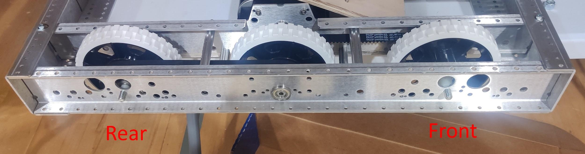

Secure the Chassis Outside Plates in place using six 10-32 x 0.5" bolts and 10-32 Nylock nuts each. Secure the front and rear axles by tightening the 3/8-16 nuts onto the axle bolts so that the wheels can still spin. The axle bolts and nuts are both tightened using a 9/16” socket or wrench. Attach the four 3.375” churros to the Chassis Outside Plate using 1/4-20 x 0.75” form-threading bolts (am-1591).

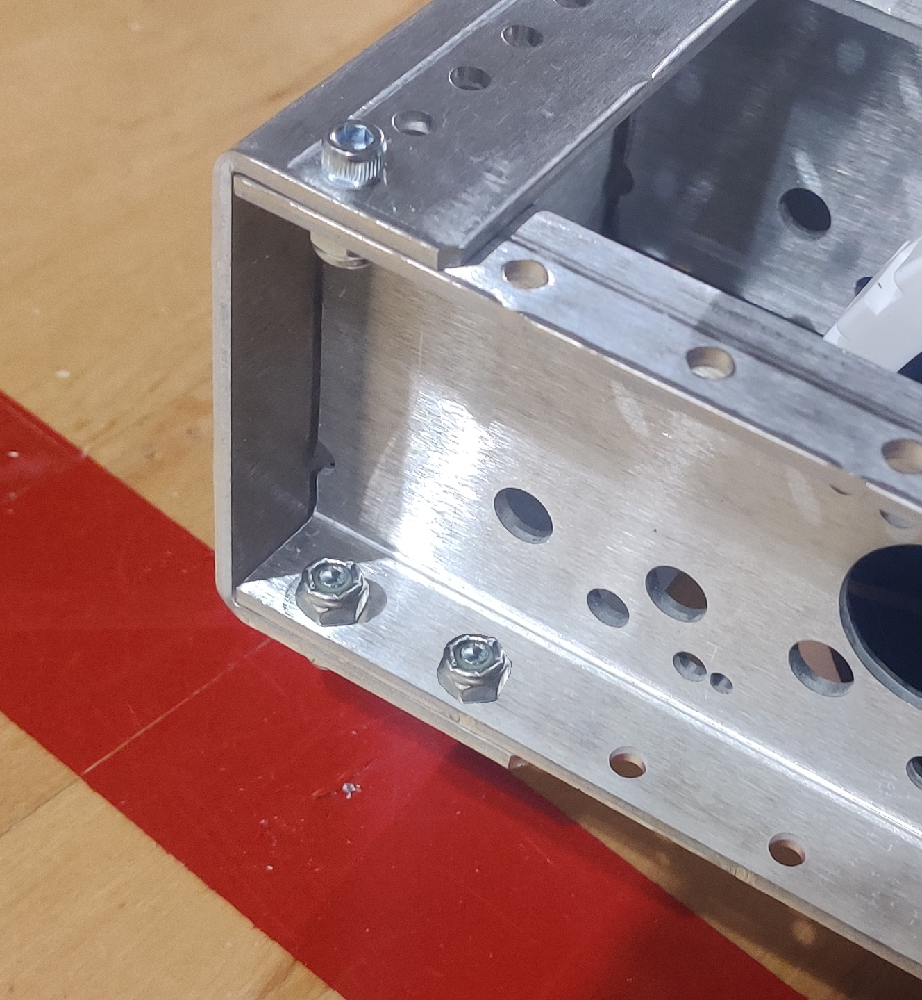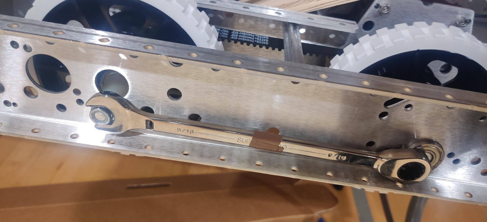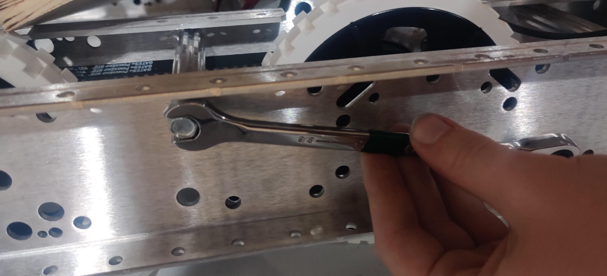

The same steps are followed on the other side of the chassis to complete the drivetrain. Make sure you pay attention to the placement of the belts for the front and rear of the robot so that you end up with a "mirrored" belt arrangement on your chassis as opposed to a “rotated” one.

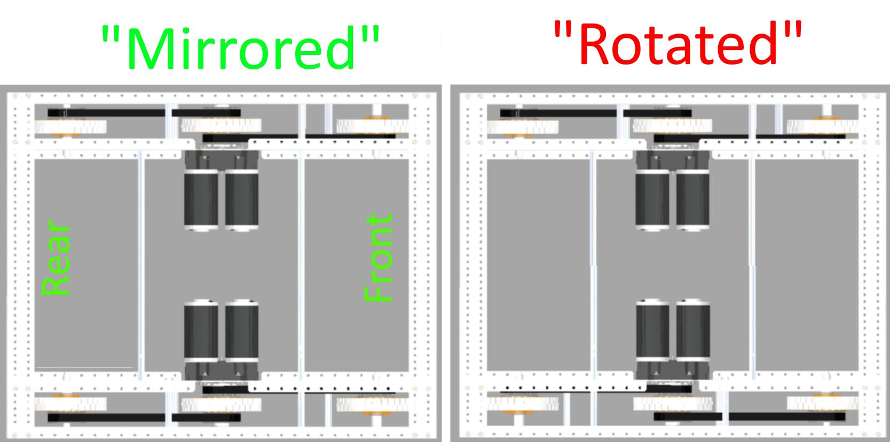

